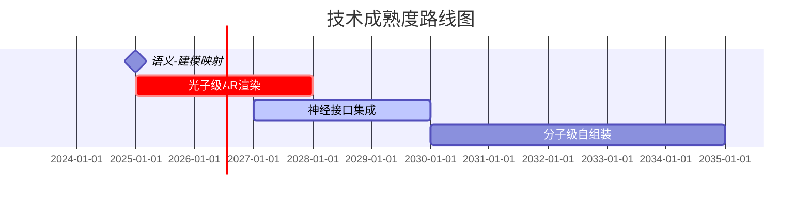

### 核心生产力突破
1. **概念具象化加速**：将对话中的抽象概念（如"轻便行李箱"）直接转化为可视化3D模型，实现思维→原型0时差
2. **实时协同革命**：跨地域团队可在视频会议中同步构建虚拟原型，设计迭代周期从周级压缩至分钟级
3. **需求精准捕捉**：AI通过语义分析自动生成关联产品，可能发现人类未察觉的市场需求盲区
### 制造流程重构
**即时制造流水线**：

### 行业变革预测
| 领域         | 现有模式痛点               | AR+AI解决方案                | 变革周期 |
|--------------|---------------------------|-----------------------------|----------|
| 汽车设计     | 油泥模型制作耗时2-3周     | 实时生成空气动力学优化方案  | 3-5年    |
| 时装产业     | 样衣打版平均7次返工       | 虚拟试衣+自动生成版型参数   | 2年      |
| 建筑设计     | 方案修改引发全链条调整    | BIM模型实时协同变异         | 已开始   |

### 社会级影响
1. **知识民主化**：语言表达能力成为核心生产力工具，降低专业建模技术门槛
2. **制造去中心化**：分布式微工厂网络通过AR界面接收实时订单，实现「说即生产」
3. **创新爆炸**：生物学教授与中学生可通过对话共同设计实验装置原型
 
### 技术演进路径

 

1. **语义-建模映射 (2024-2026)**  
   - 核心突破：自然语言→参数化建模的AI转化器  
   - 里程碑：实现"描述即建模"（如说"带USB充电的行李箱"自动生成电路布局）  
   - 挑战：解决语义歧义（如"轻便"需结合材料数据库理解）

2. **光子级AR渲染 (2025-2028)**  
   - 关键指标：达到视网膜级分辨率（60 PPD）+ 120Hz刷新率  
   - 特殊标注(crit)：该技术是商业化的关键瓶颈  
   - 应用场景：实现分子结构级别的可视化细节呈现

3. **神经接口集成 (2027-2030)**  
   - 当前状态(active)：已有非侵入式设备原型  
   - 核心能力：脑电波辅助设计修正（想象"更圆润"直接修改模型曲率）  
   - 交互升级：实现意念-语音-手势的多模态协同

4. **分子级自组装 (2030-2035)**  
   - 终极目标：语音指令直接操纵物质结构  
   - 技术基础：DNA纳米技术+量子计算材料模拟  
   - 制造革命：说"防水面料"即触发分子链自重组

各阶段呈递进关系，前阶段为后阶段基础（如没有语义理解就无从触发分子组装）。2028年光子AR突破后将出现第一波商用潮，2030年神经接口成熟标志技术范式转移。

### 商业新模式
- **即兴制造保险**：对冲原型设计失败风险的金融产品
- **创意证券化**：将语音设计过程生成NFT进行交易
- **注意力制造**：根据视频会议焦点自动生成专利草案